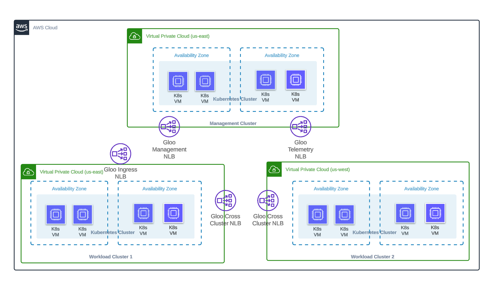

## Lab 01 - Deploy EKS clusters <a name="lab-01---deploy-eks-clusters-"></a>

# Deploying 3 EKS clusters using eksctl



[eksctl](https://eksctl.io/) is a useful tool in creating EKS clusters. This guide will show you how to create 3 working clusters to use for this demo.

* Deploy the web cluster
```shell
eksctl create cluster -f data/web.yaml
```

* Deploy the second cluster
```shell
eksctl create cluster -f data/lob-01.yaml
```

* Deploy the third cluster
```shell
eksctl create cluster -f data/lob-02.yaml
```

* Deploy the forth cluster
```shell
eksctl create cluster -f data/management.yaml
```

* Update the kubernetes context names
```shell
export AWS_USER=<user>
kubectl config rename-context $AWS_USER@cluster-1.us-east-2.eksctl.io web
kubectl config rename-context $AWS_USER@cluster-2.us-west-2.eksctl.io lob-01
kubectl config rename-context $AWS_USER@cluster-2.us-west-2.eksctl.io lob-02
kubectl config rename-context $AWS_USER@management.us-east-2.eksctl.io management
```

## Install AWS [Load Balancer Controller](https://docs.aws.amazon.com/eks/latest/userguide/aws-load-balancer-controller.html)

The AWS Load Balancer Controller manages AWS Elastic Load Balancers for a Kubernetes cluster. The controller provisions the following resources:
  * An AWS Network Load Balancer (NLB) when you create a Kubernetes service of type LoadBalancer.

* Create IAM Policy to allow service accounts to create aws load balancers
```shell
curl -o iam_policy.json https://raw.githubusercontent.com/kubernetes-sigs/aws-load-balancer-controller/v2.4.7/docs/install/iam_policy.json

aws iam create-policy \
    --policy-name AWSLoadBalancerControllerIAMPolicy \
    --policy-document file://iam_policy.json
```

* Enable OIDC provider for service accounts
```shell
eksctl utils associate-iam-oidc-provider --region=us-east-1 --cluster=web --approve
eksctl utils associate-iam-oidc-provider --region=us-east-1 --cluster=lob-1 --approve
eksctl utils associate-iam-oidc-provider --region=us-east-1 --cluster=lob-2 --approve
eksctl utils associate-iam-oidc-provider --region=us-east-1 --cluster=management --approve
```

* Create a Kubernetes service account named aws-load-balancer-controller in the kube-system namespace for the AWS Load Balancer Controller and annotate the Kubernetes service account with the name of the IAM role.
```shell
export AWS_ACCOUNT_ID=<account_id>
eksctl create iamserviceaccount \
  --cluster=web \
  --region us-east-1 \
  --namespace=kube-system \
  --name=aws-load-balancer-controller \
  --attach-policy-arn=arn:aws:iam::$AWS_ACCOUNT_ID:policy/AWSLoadBalancerControllerIAMPolicy \
  --override-existing-serviceaccounts \
  --approve

eksctl create iamserviceaccount \
  --cluster=lob-01 \
  --region us-east-1 \
  --namespace=kube-system \
  --name=aws-load-balancer-controller \
  --attach-policy-arn=arn:aws:iam::$AWS_ACCOUNT_ID:policy/AWSLoadBalancerControllerIAMPolicy \
  --override-existing-serviceaccounts \
  --approve


eksctl create iamserviceaccount \
  --cluster=lob-02 \
  --region us-west-1 \
  --namespace=kube-system \
  --name=aws-load-balancer-controller \
  --attach-policy-arn=arn:aws:iam::$AWS_ACCOUNT_ID:policy/AWSLoadBalancerControllerIAMPolicy \
  --override-existing-serviceaccounts \
  --approve

eksctl create iamserviceaccount \
  --cluster=management \
  --region us-east-1 \
  --namespace=kube-system \
  --name=aws-load-balancer-controller \
  --attach-policy-arn=arn:aws:iam::$AWS_ACCOUNT_ID:policy/AWSLoadBalancerControllerIAMPolicy \
  --override-existing-serviceaccounts \
  --approve
```

* Install load balancer controller to each cluster
```shell
helm repo add eks https://aws.github.io/eks-charts
helm repo update

helm install aws-load-balancer-controller eks/aws-load-balancer-controller \
  -n kube-system \
  --kube-context web \
  --set clusterName=web \
  --set serviceAccount.create=false \
  --set serviceAccount.name=aws-load-balancer-controller 

helm install aws-load-balancer-controller eks/aws-load-balancer-controller \
  -n kube-system \
  --kube-context lob-01 \
  --set clusterName=lob-01 \
  --set serviceAccount.create=false \
  --set serviceAccount.name=aws-load-balancer-controller 

helm install aws-load-balancer-controller eks/aws-load-balancer-controller \
  -n kube-system \
  --kube-context lob-02 \
  --set clusterName=lob-02 \
  --set serviceAccount.create=false \
  --set serviceAccount.name=aws-load-balancer-controller 

helm install aws-load-balancer-controller eks/aws-load-balancer-controller \
  -n kube-system \
  --kube-context management \
  --set clusterName=management \
  --set serviceAccount.create=false \
  --set serviceAccount.name=aws-load-balancer-controller
```
