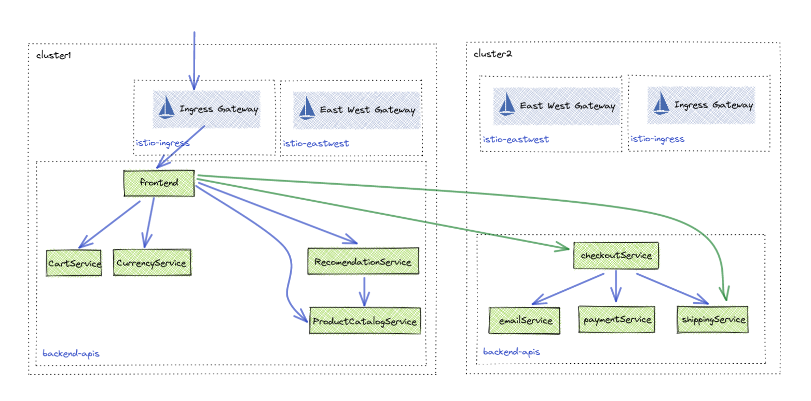
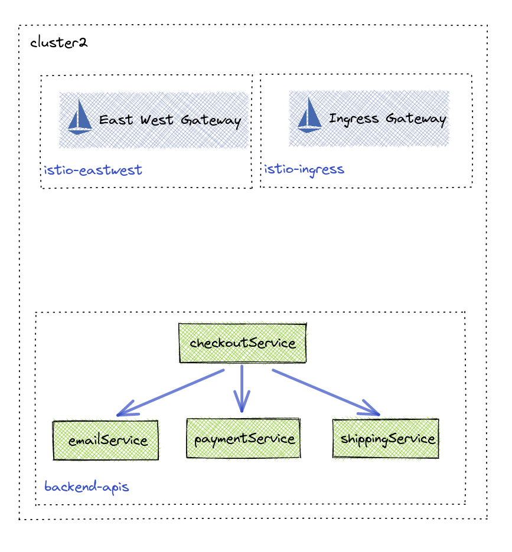
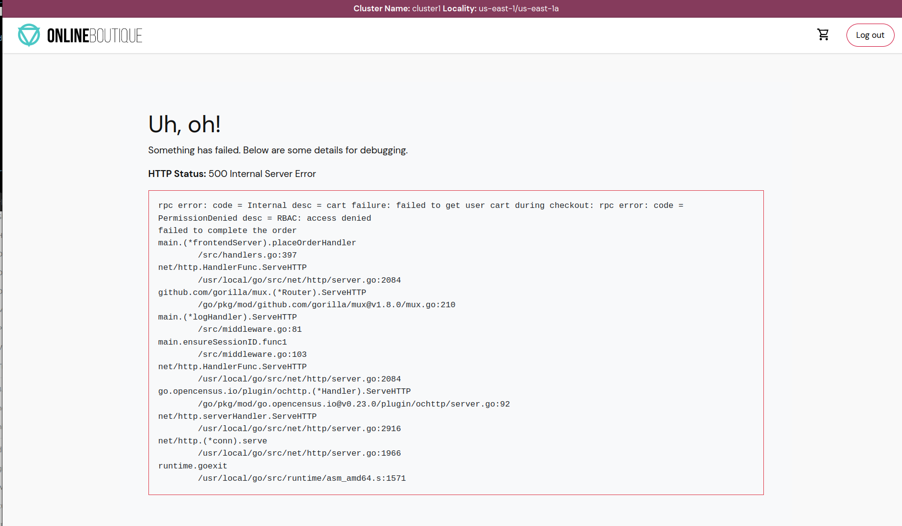

## Lab 10 - Multi Cluster Secure Communication <a name="lab-10---multi-cluster-secure-communication-"></a>


To show the ease at which Gloo Platform can extend application routing beyond a single cluster, this lab will deploy a portion of the online boutique feature to another cluster. In order to checkout and buy your items, the frontend application needs to reach the checkout APIs. By using the Gloo Platform `VirtualDestination` API, multi-cluster applications can be represented by a "Global" hostname that can be reached by any other application that has Gloo Platform installed. 


Links:
- [Multi-Cluster Routing Docs](https://docs.solo.io/gloo-mesh-enterprise/main/concepts/traffic-management/multi-cluster/)
- [Virtual Destination API](https://docs.solo.io/gloo-mesh-enterprise/main/reference/api/virtual_destination/)

## Deploy Checkout to cluster-2


* Create `checkout-apis ` namespace in lob
```shell
kubectl apply --context lob -f data/namespaces.yaml
```

* Deploy checkout APIs to cluster-2
```shell
helm upgrade -i checkout-apis --version "5.0.3" oci://us-central1-docker.pkg.dev/field-engineering-us/helm-charts/onlineboutique \
  --namespace checkout-apis  \
  --kube-context lob \
-f data/checkout-values.yaml
```

## Configure Gloo Platform for Checkout Team

The checkout APIs will be managed by the `checkout-team` in lob. To represent this, a new Gloo `Workspace` will be created for this team and its services will be exported to the `app-team`. The `app-team` workspace will need to be updated to import the `checkout-team` services.

* Create administration namespace for checkout-team
```shell
kubectl create namespace checkout-team --context mgmt
```

* Create workspace for checkout-team
```shell
kubectl apply --context mgmt -f - <<EOF
apiVersion: admin.gloo.solo.io/v2
kind: Workspace
metadata:
  name: checkout-team
  namespace: gloo-mesh
spec:
  workloadClusters:
  # admistrative namespace
  - name: 'mgmt'
    namespaces:
    - name: checkout-team
  # workload cluster namespace
  - name: '*'
    namespaces:
    - name: checkout-apis
---
apiVersion: admin.gloo.solo.io/v2
kind: WorkspaceSettings
metadata:
  name: checkout-team
  namespace: checkout-team
spec:
  # share service discovery with app-team
  exportTo:
  - workspaces:
    - name: app-team
    - name: ops-team
  # import apis from app team
  importFrom:
  - workspaces:
    - name: app-team
  options:
    eastWestGateways:
    - selector:
        labels:
          app: gloo-internal-gateway
EOF
```

* Update app-team Workspace to import checkout apis
```shell
kubectl apply --context mgmt -f - <<EOF
apiVersion: admin.gloo.solo.io/v2
kind: WorkspaceSettings
metadata:
  name: app-team
  namespace: app-team
spec:
  # import gateway service for ingress
  importFrom:
  - workspaces:
    - name: ops-team
  - workspaces:
    - name: checkout-team
  # share service discovery and routing to ingress
  exportTo:
  - workspaces:
    - name: ops-team
  - workspaces:
    - name: checkout-team
  options:
    eastWestGateways:
    - selector:
        labels:
          app: gloo-internal-gateway
EOF
```

* View workspace in Gloo Mesh UI
```shell
kubectl port-forward svc/gloo-mesh-ui 8090:8090 --context mgmt -n gloo-mesh
echo "Gloo UI: http://localhost:8090"
```

## Setup Global Services

In order to facilitate multi-cluster routing, Gloo Platform `VirtualDestinations` need to be created for applications being called in other clusters. By creating `VirtualDestinations` and assigning them a unique global hostname, applications running in other clustes can seamlessly make requests to services in other clusters. 

* Create Global Services for checkout-apis
```shell
kubectl apply --context mgmt -f - <<EOF
apiVersion: networking.gloo.solo.io/v2
kind: VirtualDestination
metadata:
  name: checkout
  namespace: checkout-team
spec:
  hosts:
  - checkout.checkout-team.tcb.mesh
  services:
  - labels:
      app: checkoutservice
  ports:
  - number: 81
    protocol: HTTP
    targetPort:
      name: http
  - number: 80
    protocol: GRPC
    targetPort:
      name: grpc
---
apiVersion: networking.gloo.solo.io/v2
kind: VirtualDestination
metadata:
  name: shipping
  namespace: checkout-team
spec:
  hosts:
  - shipping.checkout-team.tcb.mesh
  services:
  - labels:
      app: shippingservice
  ports:
  - number: 81
    protocol: HTTP
    targetPort:
      name: http
  - number: 80
    protocol: GRPC
    targetPort:
      name: grpc
EOF
```

* Create Global Services for app team apis
```shell
kubectl apply --context mgmt -n app-team -f data/app-team-global-services.yaml
```

* Update frontend to call checkout global services.
```shell
helm upgrade -i online-boutique --version "5.0.3" oci://us-central1-docker.pkg.dev/field-engineering-us/helm-charts/onlineboutique \
  --namespace online-boutique  \
  --kube-context web \
  -f data/frontend-values.yaml
```

* Test multi cluster routing

## Update Access Policies


Due to the `app-team` and `checkout-team` employing zero trust architectures, they both need to create policies that allow services to communicate between workspaces. 

* Allow app-team to use checkout apis
```shell
kubectl apply --context mgmt -f - <<EOF
apiVersion: security.policy.gloo.solo.io/v2
kind: AccessPolicy
metadata:
  name: allow-app-team-frontend
  namespace: checkout-team
spec:
  applyToDestinations:
  - selector:
      workspace: checkout-team
      name: checkoutservice
  - selector:
      workspace: checkout-team
      name: shippingservice
  config:
    authz:
      allowedClients:
      - serviceAccountSelector:
          workspace: app-team
          name: frontend
          cluster: 'cluster-1'
      - serviceAccountSelector:
          workspace: app-team
          name: frontend
          cluster: 'cluster-2'
---
apiVersion: security.policy.gloo.solo.io/v2
kind: AccessPolicy
metadata:
  name: in-namespace-access
  namespace: checkout-team
spec:
  applyToDestinations:
  - selector:
      workspace: checkout-team
  config:
    authz:
      allowedClients:
      - serviceAccountSelector:
          workspace: checkout-team
---
apiVersion: security.policy.gloo.solo.io/v2
kind: AccessPolicy
metadata:
  name: ingress-gateway-access
  namespace: checkout-team
spec:
  applyToDestinations:
  - selector:
      workspace: checkout-team
      name: checkoutservice
  - selector:
      workspace: checkout-team
      name: shippingservice
  config:
    authz:
      allowedClients:
      - serviceAccountSelector:
          workspace: ops-team
EOF
```

* Allow checkout team to use app team apis
```shell
kubectl apply --context mgmt -f - <<EOF
apiVersion: security.policy.gloo.solo.io/v2
kind: AccessPolicy
metadata:
  name: allow-checkout-apis
  namespace: app-team
spec:
  applyToDestinations:
  - selector:
      workspace: app-team
      name: productcatalogservice
  - selector:
      workspace: app-team
      name: cartservice
  - selector:
      workspace: app-team
      name: currencyservice
  - selector:
      workspace: app-team
      name: emailservice
  config:
    authz:
      allowedClients:
      # only allow checkout api access
      - serviceAccountSelector:
          namespace: checkout-apis
          name: checkoutservice
          cluster: 'cluster-2'
EOF
```
