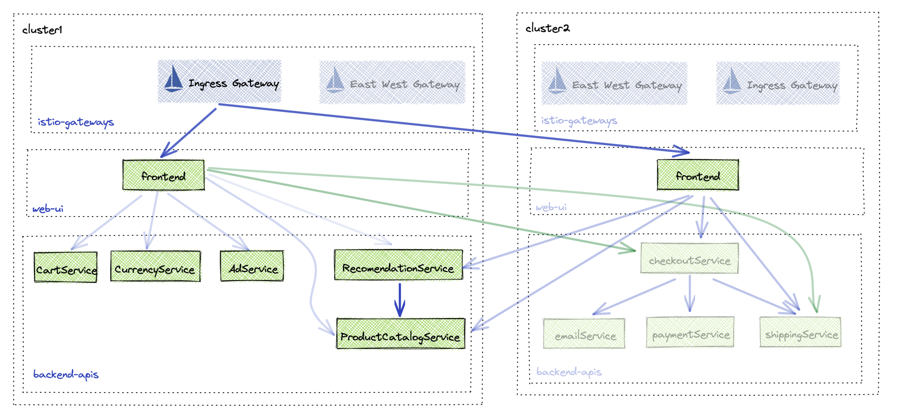
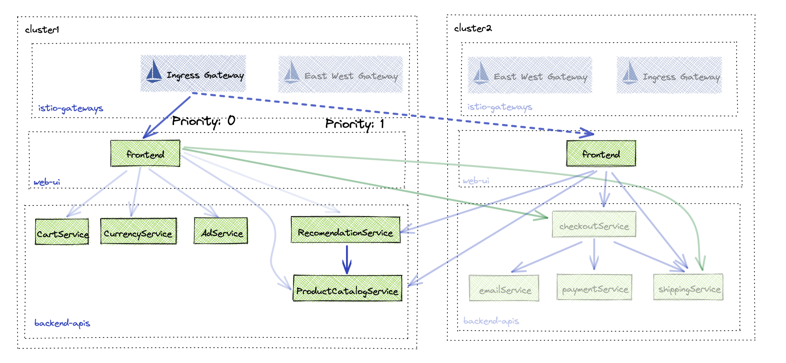

## Lab 13 - Circuit Breaking and Failover <a name="lab-13---circuit-breaking-and-failover-"></a>

Gloo Platform can enable your applications to be highly available by allowing you to deploy them accross multiple clusters and localities. Gloo Platform can automatically detect these new deployments and add them as available endpoints for routing.
In many cases it would be inneficient to route to all available endpoints across localities. By adding outlier detection and failover policies, you can create a ciruit breaking strategy that is efficienct and effective.

Links:
  - [Failover](https://docs.solo.io/gloo-mesh-enterprise/latest/policies/failover/)
  - [Outlier Detection](https://docs.solo.io/gloo-mesh-enterprise/latest/policies/outlier-detection/)
  - [FailoverPolicy API](https://docs.solo.io/gloo-mesh-enterprise/latest/reference/api/failover_policy/)
  - [OutlierDetectionPolicy API](https://docs.solo.io/gloo-mesh-enterprise/latest/reference/api/outlier_detection_policy/)

## Deploy HA frontend

This lab will deploy the frontend application to both web and lob and update the ingress routing to route to both availabile endpoints. You will then tune the routing to prefer the local frontend and failover to the other when something bad happens. 


* Create online-boutique namespace in lob
```shell
kubectl apply --context lob -f - <<EOF
apiVersion: v1
kind: Namespace
metadata:
  labels:
    istio.io/rev: 1-16
  name: online-boutique
EOF
```

* Deploy frontend in lob
```shell
helm upgrade -i ha-frontend --version "5.0.3" oci://us-central1-docker.pkg.dev/field-engineering-us/helm-charts/onlineboutique \
  --kube-context lob \
  --namespace online-boutique \
  --set clusterName=lob \
  -f  data/web-ui-values.yaml
```

* Wait until the frontend in lob is ready.

* Create a VirtualDestination to represent both frontend applications.
```shell
kubectl apply --context mgmt -f - <<EOF
apiVersion: networking.gloo.solo.io/v2
kind: VirtualDestination
metadata:
  name: frontend
  namespace: app-team
spec:
  hosts:
  - frontend.app-team.demo.example.com
  services:
  - labels:
      app: frontend
  ports:
  - number: 80
    protocol: HTTP
    targetPort:
      name: http
EOF
```

* Then update the ingress routing to route to the VirtualDestination
```shell
kubectl apply --context mgmt -f - <<EOF
apiVersion: networking.gloo.solo.io/v2
kind: RouteTable
metadata:
  name: frontend
  namespace: app-team
spec:
  workloadSelectors: []
  http:
    - name: frontend
      labels:
        virtual-destination: frontend
      forwardTo:
        destinations:
          - ref:
              name: frontend
              namespace: app-team
            kind: VIRTUAL_DESTINATION
            port:
              number: 80
EOF
```

* By default the ingress gateway will now route to both frontend applications in a round robin pattern.

## Locality Based Routing

In order to enable locality based routing, you need to define some parameters to organize and prioritize the available endpoints. First configuring a FailoverPolicy will set the rules for ordering endpoints based on their locality to the client. Secondly, parameters need to be configured to tell the client when it should prefer another set of endpoints (ie. when to circuit break). The OutlierDetection policy sets the conditions for then an endpoint is deemed unhealthy and will be removed from routing. 



* Create a FailoverPolicy to setup an ordered list of endpoints. 
```shell
kubectl apply --context mgmt -f - <<EOF
apiVersion: resilience.policy.gloo.solo.io/v2
kind: FailoverPolicy
metadata:
  name: failover
  namespace: app-team
spec:
  applyToDestinations:
  - kind: VIRTUAL_DESTINATION
    selector:
      namespace: app-team
  config:
    # enable default locality based load balancing
    localityMappings: []
EOF
```

* Add an OutlierDetectionPolicy to set the conditions of when an endpoint is considered unhealthy.
```shell
kubectl apply --context mgmt -f - <<EOF
apiVersion: resilience.policy.gloo.solo.io/v2
kind: OutlierDetectionPolicy
metadata:
  name: outlier-detection
  namespace: app-team
spec:
  applyToDestinations:
  - kind: VIRTUAL_DESTINATION
    selector:
      namespace: app-team
  config:
    consecutiveErrors: 2
    interval: 5s
    baseEjectionTime: 15s
    maxEjectionPercent: 100
EOF
```

* Refresh online boutique to observe locality based routing

## Perform Failover

With the configurations in place, Gloo Platform will configure the ingress and proxy sidecars to automatically failover when the OutlierDetection parameters are met. To simulate this, the frontend in web will be configured to no longer respond to traffic. The ingress gateway will observe this behavior and automatically remove web frontend from the list of available endpoints. It will then prefer the endpoint in lob until web frontend is healthy again. 


* Break frontend in web so that it can no longer respond to traffic
```shell
kubectl patch deploy frontend --patch '{"spec":{"template":{"spec":{"containers":[{"name":"server","command":["sleep","20h"],"readinessProbe":null,"livenessProbe":null}]}}}}' --context web -n online-boutique
```

**NOTE:** You will see 2 errors before being failed over. These could have been avoided using a retry policy.


* Refresh the Online Boutique and observe the error and failover to lob

* Fix frontend in web
```shell
kubectl patch deploy frontend --patch '{"spec":{"template":{"spec":{"containers":[{"name":"server","command":[],"readinessProbe":null,"livenessProbe":null}]}}}}' --context web -n online-boutique
```

* Refresh the Online Boutique and observe the traffic be redirected back to the web frontend once it\'s healthy.
